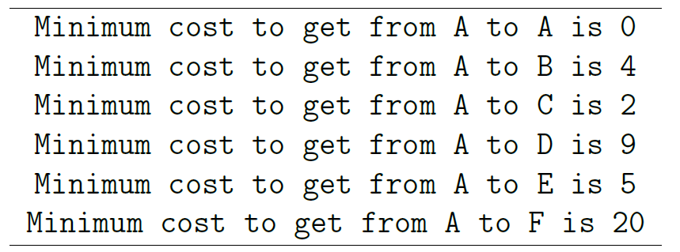

# Distributed Graph Processing - TLAV-Pregel
Project of Semantic Data Management (SDM) Course for the Master in Data Science Program of Universitat Politècnica de Catalunya (UPC)

***

This repository is focused on exploring distributed-graph processing libraries such as GraphX’s Pregel API[^1], as well as introducing Spark Graph Frames[^2].

GraphX is a component of Spark for graphs and graph-parallel computation, providing a collection of graph algorithms (e.g., Page Rank, Triangle Counting and Connected Components) and some fundamental operations on graphs based on Think Like A Vertex (TLAV) technique.

The structure of this repository follows the structure presented below:
* **Exercise 1**: Getting familiar with GraphX's Pregel API
* **Exercise 2**: Computing shortest paths using Pregel
* **Exercise 3**: Extending shortest path's computation
* **Exercise 4**: Spark Graph Frames

The programmatic solution of the exercises can be found in the folder [SparkGraphXassignment](./SparkGraphXassignment/), and the report of the project in this [file](./docs/Report.pdf).

Most of the information included below, is extracted from the [laboratory's assignment statement](./docs/Distributed%20Graph%20Lab.pdf) and an [introductory presentation to distributed processing of graphs](./docs/Distributed%20Graph%20Processing%20-%20TLAV-Pregel.pdf), provided by UPC[^3].

***

# Exercise 1: Getting familiar with GraphX's Pregel API

In this exercise GraphX's Pregel-style vertex-centric programming model is being introduced and we apply this model to implement some graph algorithms. Pregel-style vertex-centric computation model consists of a sequence of iterations, called **supersteps**. Assuming an **input graph** with type **G** and a **message** type **A**, each **superstep** **S** follows a GAS (Gather-Apply-Scatter) paradigm:

* **Gather**: also known as `merge`, receives and reads messages that are sent to a **node v** from the previous superstep `S - 1`. This function must be commutative and associative.

* **Apply**: also known as vertex program, applies a `user-defined function` **f** to each vertex in parallel; meaning that **f** specifies the behavior of a single vertex **v** at a particular superstep **S**. On the first iteration, the vertex program is invoked on all vertices and the pre-defined message is passed. On subsequent iterations, the vertex program is only invoked on those vertices that receive messages.

* **Scatter**: also known as `send message`, may send messages to other vertices, such that those vertices will receive the messages in the next superstep `S + 1`.

[Exercise_1.java](./SparkGraphXassignment/src/main/java/exercise_1/Exercise_1.java) implements the `maxValue` function which applies the GAS paradigm presented above in order to find the maximum value of the following graph, but in a distributed manner.

By taking a look at the provided solution the following software components are developed:

* **VProg** (corresponding to the `Apply phase`): in the case of the first superstep the vertex value, otherwise sends the maximum of the vertex value and the received message.
* **sendMsg** (corresponding to the `Scatter phase`): if the destination vertex value is smaller than the current value, we will send the current value to it. Otherwise, we do not send anything.
* **merge** (corresponding to the `Gather phase`): in this case, the logic for the function is the same as the vertex program.

Finally, we have the call to the `Pregel framework`. The parameters are as follows:
* **initialMsg** is the message that all vertices will receive at the start of superstep 0. Here we use `Int.MaxValue` just for the purpose of identifying superstep 0 (as we shall see later).
* **maxIter** indicates the maximum number of iterations (i.e., supersteps). Here we set it as `Int.MaxValue` as convergence is guaranteed.
* **activeDir** refers to the edge direction in which to send the message. 

Take the graph above with four vertices as an example, assume Vertex 2 becomes active and wants to send a message to its neighbors. If: 

* **EdgeDirection.Out** is set, the message is sent to Vertex 3 and Vertex 4 (ie., along outgoing direction).
* **EdgeDirection.In** is set, the message is sent to Vertex 1 (i.e., along ingoing direction).
* **EdgeDirection.Either** is set, the message is sent to all the other three vertices.
* **EdgeDirection.Both** is set, the message is sent to `Vertex 1/Vertex 3/Vertex 4`. Only when `Vertex 1/Vertex 3/Vertex 4` are also active.
* The three next parameters are references to each of the three previously described functions.
* Evidence, the definition of the class being passed as message. Note the usage of scala.reflect.ClassTag$.MODULE$.apply(Integer.class), which uses Scala's API.

***

# Exercise 2: Computing shortest paths using Pregel

In this exercise ([Exercise_2.java](./SparkGraphXassignment/src/main/java/exercise_2/Exercise_2.java)), the `computation of the shortest paths` from a source in the provided graph is being implemented. Precisely, the computation of the cost for the shortest paths from node 1 to the rest of the network is requested. The following output is obtained as the result:

More details about the implementation can be found in the corresping [java script](./SparkGraphXassignment/src/main/java/exercise_2/Exercise_2.java). An explanation of the solution provided is included in the [final report](./docs/Report.pdf), under the respective section.
***

# Exercise 3: Extending shortest path's computation

You might have realized that *the previous computation of shortest paths was a bit limited*, as `we could know the minimum cost to get from A to any other node but not the actual path`. To this end, in this exercise ([Exercise_3.java](./SparkGraphXassignment/src/main/java/exercise_3/Exercise_3.java)) it is asked to extend such implementation to include the minimum path. This entails considering additional data structures in the graph and properly update them in Pregel. Given the graph from the previous exercise the following output should be obtained:

More details about the implementation can be found in the corresping [java script](./SparkGraphXassignment/src/main/java/exercise_3/Exercise_3.java). An explanation of the solution provided is included in the [final report](./docs/Report.pdf), under the respective section.

***

# Exercise 4: Spark Graph Frames

In this exercise we will use Spark GraphFrames[^2] for distributed graph processing in the Spark ecosystem. GraphFrames is a package for Apache Spark[^4] that provides DataFrame-based Graphs. It provides high-level APIs in Scala, Java, and Python. It aims to provide both the functionality of GraphX seen in the previous exercises and extended functionality taking advantage of Spark DataFrames.

In the Java project, the [GraphFrames library](./SparkGraphXassignment/lib/graphframes-0.5.0-spark2.1-s_2.10.jar) is provided (as it is not yet published in `Maven Central`), make sure that the locally specified dependency in [pom.xml](./SparkGraphXassignment/pom.xml) is working.

To continue with, in folder [exercise_4](./SparkGraphXassignment/src/main/java/exercise_4/) one can find both a [warmup exercise](./SparkGraphXassignment/src/main/java/exercise_4/Exercise_4_warmup.java) plus a [more advanced one](./SparkGraphXassignment/src/main/java/exercise_4/Exercise_4.java).

The [warmup exercise]((./SparkGraphXassignment/src/main/java/exercise_4/Exercise_4_warmup.java)) depicts a `social network`. Say we have a social network with users connected by relationships. We can represent the network as a graph, which is a set of vertices (users) and edges (connections between users). A toy example is shown below.

This script provides the foundations of building a graph, in that way, that it can utilise `Spark Graph Frames` for parallel processing.

However, [the more advanced exercise](./SparkGraphXassignment/src/main/java/exercise_4/Exercise_4.java) is using a short `XML dump` of articles from wikipedia. The dataset is stored in two files in the [resources folder](./SparkGraphXassignment/src/main/resources/): 
* [wiki-vertices.txt](./SparkGraphXassignment/src/main/resources/wiki-vertices.txt), and 
* [wiki-edges.txt](./SparkGraphXassignment/src/main/resources/wiki-edges.txt).

The **former** contains articles `by ID and title` and the **latter** contains the `link structure` in the **form of source-destination ID pairs**.

The implementation of this exercise includes:
* The loading of the Graph from the 2 mentioned files.
* The implementation and execution of `PageRank` algorithm to evaluate what the most important pages in the Wikipedia graph are, with final goal the finding of the **10 most relevant articles** from the provided Wikipedia dataset.

Details about the way `PageRank` works can be found in the [laboratory's assignment statement](./docs/Distributed%20Graph%20Lab.pdf).

Finally, the solution provided can be found in this [script](./SparkGraphXassignment/src/main/java/exercise_4/Exercise_4.java). An explanation of the solution provided is included in the [final report](./docs/Report.pdf), under the respective section.

[^1]: https://spark.apache.org/docs/3.2.1/api/java/org/apache/spark/graphx/Pregel.html
[^2]: https://graphframes.github.io/graphframes/docs/_site/index.html
[^3]: https://www.upc.edu/ca
[^4]: https://spark.apache.org/